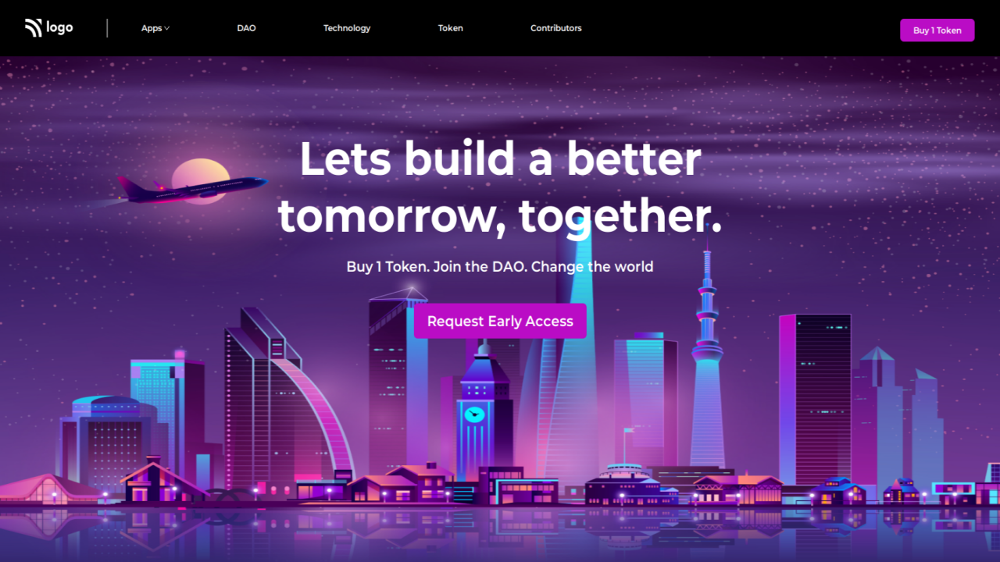

# Project 5

## `Nishok Maharaaj`

## Learnings   

This is the fifth project in the HTML and CSS class. I have learnt how to position background image and fit them perfectly.

## Efforts

This project took around 2 hours to build. Designing the headings and navbar took most of the time

### Screenshot

